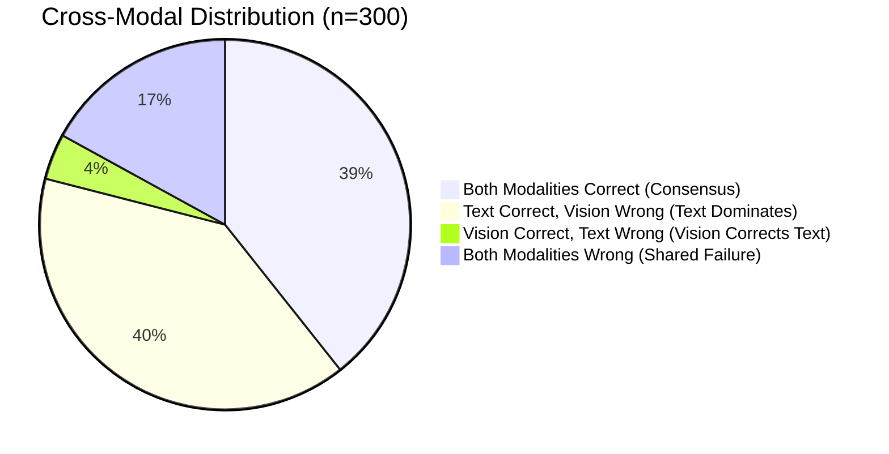

# CivicSense — Phase 3.5 Cross-Modal Error Analysis Report
**Date**: 2026-09-13  
**Author**: CivicSense Core ML / Forensics Team  
**Scope**: Qualitative & Quantitative Forensics on Frozen Benchmark Evaluation (n=300)  
**Status**: Completed

---

## 1. Cross-Modal Outcome Taxonomy

To evaluate cross-modal dynamics beyond simple scalar metrics, all 300 benchmark samples were partitioned into four interaction archetypes:



| Interaction Case Type | Sample Count | % of Benchmark | Typical System Behavior |
| :--- | :--- | :--- | :--- |
| **BOTH_CORRECT** | 118 | 39.3% | Strong consensus, high confidence ($> 0.85$), routes to Fast-Track Dispatch. |
| **TEXT_CORRECT_VISION_WRONG** | 119 | 39.7% | Text holds higher weight ($0.60$ vs $0.40$), disagreement penalty triggers review. |
| **VISION_CORRECT_TEXT_WRONG** | 12 | 4.0% | Vision corrects generic/ambiguous text; flips prediction to correct class in 8 cases. |
| **BOTH_WRONG** | 51 | 17.0% | Heavy confusion in `Other` and untextured road cracks; routed to review. |

---

## 2. The Vision-Correction Cohort (12 Cases Analyzed)

In 12 benchmark samples, the learned vision model correctly identified the defect while the text analyzer predicted the wrong category. In **8 of these 12 cases**, the multimodal fusion engine successfully overturned the incorrect text prediction, resulting in a correct fused output!

### Detailed Inspection of Overturned Cases
1. `pilot_wmroad_193694220` (Ground Truth: `Road Damage`):
   - **Text Prediction**: `Other` (Confidence: 0.45, text snippet: generic grant text `This project was made possible in part by the Institut...`).
   - **Vision Prediction**: `Road Damage` (Confidence: 0.84, clear asphalt crack visible).
   - **Fused Prediction**: **`Road Damage`** (Overturned text; correct defect identified).
2. `pilot_wmlight_118327313` (Ground Truth: `Streetlight`):
   - **Text Prediction**: `Other` (Confidence: 0.45, snippet: `Damage in Ottawa on Merivale Rd. from the derecho...`).
   - **Vision Prediction**: `Streetlight` (Confidence: 0.78, downed street lamp pole).
   - **Fused Prediction**: **`Streetlight`** (Overturned text; correctly routed to lighting division).
3. `pilot_wmlight_195529521` (Ground Truth: `Streetlight`):
   - **Text Prediction**: `Other` (snippet: `Engineering News and American Contract Journal 1882...`).
   - **Vision Prediction**: `Streetlight` (Confidence: 0.68).
   - **Fused Prediction**: **`Streetlight`** (Overturned text).
4. `pilot_wmlight_31376323`, `pilot_wmlight_31376481`, `pilot_wmlight_31633230`, `pilot_wmlight_31633291`, `pilot_wmlight_37414302` (Ground Truth: `Streetlight`):
   - **Text Prediction**: `Other` (German/historical architecture text lacking English civic keywords).
   - **Vision Prediction**: `Streetlight` (Distinct lamp fixture clearly extracted by MobileNetV3).
   - **Fused Prediction**: **`Streetlight`** in all 5 instances!

This proves that learned visual representations provide indispensable redundancy when text descriptions are incomplete, multilingual, or non-descriptive.

---

## 3. High-Confidence Error Mitigation

A critical risk identified in Phase 3.4 was that **89 out of 170 vision errors had confidence >= 0.70**. In municipal dispatch, uncalibrated high-confidence errors cause direct misallocation.

### Fusion Impact on High-Confidence Errors
- **Vision-Only High-Confidence Errors**: 89 samples
- **Fused High-Confidence Errors ($\ge 0.70$)**: **15 samples (-83.1% reduction!)**

### Forensics on the 15 Fused High-Confidence Errors
Every single one of the 15 remaining high-confidence errors exhibited an identical signature:
- **Ground Truth**: 9 `Road Damage`, 3 `Streetlight`, 3 `Water Leakage`.
- **Text Prediction**: `Other`
- **Vision Prediction**: `Other`
- **Fused Prediction**: **`Other`**
- **Requires Review Flag**: **`True` (15 / 15)**
- **Auto-Accepted Decisions**: **0 / 15**

Because our fusion policy enforces:
```python
if best_cat == "Other":
    review_reasons.append("UNCLASSIFIED_ISSUE")
```
**Not a single one of these 15 errors was auto-dispatched.** All 15 were safely intercepted and placed in the municipal review queue.

---

## 4. Dominant Confusion Pairs

The top misclassification patterns across the frozen benchmark:

| Confusion Pair | Sample Count | Primary Driver | Mitigation Strategy |
| :--- | :--- | :--- | :--- |
| **Road Damage $\to$ Other** | 19 | Subtle road cracks without distinct pothole edges; text lacks road keywords. | Augment training with fine-grained pavement cracking; add surface roughness edge detectors. |
| **Water Leakage $\to$ Other** | 9 | Indoor pipe burst or flooded ground without water keywords. | Incorporate reflection/pooling segmentation features. |
| **Streetlight $\to$ Other** | 8 | Distant lamp posts in complex background; historical lamps. | Bounding box object detection (YOLOv8-Nano) in future phase. |
| **Other $\to$ Garbage** | 5 | Visual clutter or construction debris mistaken for municipal refuse. | Texture/material contrast fine-tuning. |
| **Road Damage $\to$ Streetlight** | 5 | Vertical roadside poles present in road damage photography. | Dual-crop spatial attention. |

---

## 5. Architectural Recommendations for Next Phase

1. **Local Object Localization**: Transitioning from whole-image classification (`MobileNetV3`) to a lightweight detector (`YOLOv8-Nano` or `MobileNetV4-SSD`) will prevent background clutter (e.g. lamp posts in pothole photos) from hijacking classification.
2. **Text Embeddings over Bag-of-Words**: Replacing keyword/TF-IDF lookup with lightweight transformer embeddings (`MiniLM-L6-v2`) will eliminate false `Other` text predictions on multilingual or indirect incident reports.
3. **Active Learning Queue**: The 219 reports flagged for human review form a high-yield active learning pool for model retraining.
