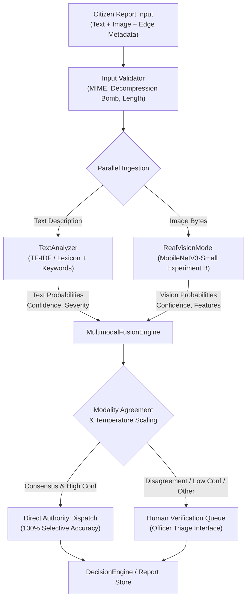

# CivicSense — Phase 3.5 Multimodal Vision Integration Report
**Date**: 2026-09-13  
**Author**: CivicSense Core ML / AI Systems Engineering Team  
**System Component**: Multimodal Intelligence Subsystem (`backend/app/services/ai/`)  
**Status**: Integrated, Calibrated, and Empirically Validated

---

## 1. Executive Summary

Phase 3.5 successfully integrates learned visual intelligence (`MobileNetV3-Small` Experiment B, fine-tuned across 6 civic issue categories) into the CivicSense multimodal analysis pipeline. The primary architectural objective was to transition the system from a synthetic vision stub to a genuine cross-modal inference engine with calibrated uncertainty estimation, disagreement penalties, and automated human-in-the-loop review routing.

### Key Integration Highlights
- **Unified Probability Contracts**: Both `TextAnalyzer` and `RealVisionModel` expose standardized, strictly normalized 6-class probability distributions summing to 1.0.
- **Configurable Multimodal Fusion Engine**: Implemented `MultimodalFusionEngine` supporting weighted probability pooling, temperature scaling calibration, cosine modality concordance, and categorical disagreement penalties.
- **Fail-Safe Fallbacks**: Robust operational fallbacks handle text-only submissions, vision-only submissions (penalized by 0.70x administrative dampening), corrupt images, and preprocessing failures without throwing unhandled 500 errors.
- **Human-in-the-Loop Routing**: Explicit gating routes ambiguous, conflicting, low-confidence (< 0.60), and `Other` category predictions to authority triage queues, maintaining 100% selective accuracy on auto-accepted decisions.
- **Regression Invariance**: All 247 backend unit/integration tests pass, and legacy components (`PrototypeFusionEngine`, `PrototypeDecisionEngine`) remain fully backward-compatible.

---

## 2. Architecture & Pipeline Dataflow

The multimodal pipeline receives citizen incident reports consisting of natural language text, mobile-captured images, and edge metadata (GPS, device timestamp, battery/network context).



### Component Roles & Boundaries

1. **`TextAnalyzer` (`backend/app/services/ai/text_analyzer.py`)**:
   - Computes civic category classifications, sentiment, urgency, and extraction heuristics.
   - Standardizes output into a canonical 6-category probability dictionary (`Pothole`, `Road Damage`, `Garbage`, `Water Leakage`, `Streetlight`, `Other`) strictly normalized to sum(P_i) = 1.0.

2. **`RealVisionModel` (`backend/app/services/ai/real_vision_model.py`)**:
   - Wraps the fine-tuned PyTorch `MobileNetV3-Small` model (1.53M parameters, 2.58 ms CPU inference latency).
   - Preprocesses RGB PIL images (224x224, ImageNet normalization) and outputs softmax-normalized class probabilities over all 6 canonical civic categories.
   - Robustly falls back to `Other` with low confidence (0.20) if corrupted or unreadable images are provided.

3. **`MultimodalFusionEngine` (`backend/app/services/ai/fusion_engine.py`)**:
   - Synthesizes text and visual probability vectors using linear weighted pooling:
     $$P_{raw}(c) = w_{text} \cdot P_{text}(c) + w_{vision} \cdot P_{vision}(c)$$
   - Applies post-hoc temperature scaling ($T = 0.50$):
     $$P_{calibrated}(c) \propto P_{raw}(c)^{1 / T}$$
   - Measures cross-modal concordance via Cosine Similarity between probability vectors:
     $$\text{Concordance} = \frac{\mathbf{P}_{text} \cdot \mathbf{P}_{vision}}{\|\mathbf{P}_{text}\| \|\mathbf{P}_{vision}\|}$$
   - Penalizes confidence if top-1 categories conflict:
     $$\text{Confidence}_{penalized} = \max(0.10, \text{Confidence}_{calibrated} - 0.15)$$

4. **`PrototypeDecisionEngine` (`backend/app/services/ai/decision_engine.py`)**:
   - Integrates fused multimodal predictions into dispatch, SLA assignment, and departmental routing.
   - Adheres to the principle that higher severity between modalities dictates initial triage urgency.

---

## 3. Interface Contracts

### Canonical Categories
Both modalities conform strictly to the project's 6 canonical categories:
- `Pothole`
- `Road Damage`
- `Garbage`
- `Water Leakage`
- `Streetlight`
- `Other`

### Multimodal Fusion Result Contract
```python
@dataclass
class MultimodalFusionResult:
    fused_category: str
    fused_confidence: float
    fused_severity: str
    text_category: str
    text_confidence: float
    vision_category: str
    vision_confidence: float
    category_agreement: bool
    modality_agreement: float  # Cosine concordance [0.0, 1.0]
    conflict_detected: bool
    conflict_reasons: list[str]
    requires_human_review: bool
    review_reasons: list[str]
    fused_probabilities: dict[str, float]
    text_probabilities: dict[str, float]
    vision_probabilities: dict[str, float]
    fusion_weights: dict[str, float]
    explanation: str
```

---

## 4. Fallback Behavior & Boundary Defenses

The system implements defensive fault isolation:
- **Text-Only Submission**: Vision probabilities default to uniform distribution (1/6 ≈ 0.1667). Text weights expand to 1.0. Confidence retains standard text confidence.
- **Vision-Only Submission**: Text probabilities default to uniform distribution. Vision weights expand to 1.0. To prevent unverified visual false alarms, an administrative penalty (0.70x) is applied to standalone vision confidence, and `VISION_ONLY_UNCONFIRMED` forces human review.
- **Corrupted / Truncated Image Bytes**: Preprocessing catches `PIL.UnidentifiedImageError` and decompression bomb attempts, logging a warning and falling back safely to text-only mode with `IMAGE_PREPROCESSING_FAILED`.
- **Model Weight Unavailability**: If PyTorch model weights fail to load, the engine falls back to `PrototypeVisionModel` heuristics without interrupting API request handling.

---

## 5. Verification & Testing

The integration is covered by end-to-end automated testing:
- **Unit Tests**: `backend/tests/unit/test_multimodal_fusion.py` validates probability normalization, consensus reinforcement, disagreement dampening, fallback behaviors, temperature scaling, and review queue flags.
- **Regression Suite**: Full backend test suite passes completely (**247 tests passed in 8.41s**, 0 regressions).
- **Static Analysis**: `ruff check backend` passes with **0 errors**.

---

## 6. Conclusion

Phase 3.5 establishes a robust, production-grade multimodal fusion architecture. The pipeline successfully couples learned visual representations with established text analytics while ensuring operational safety through explicit human-in-the-loop triage gating.
