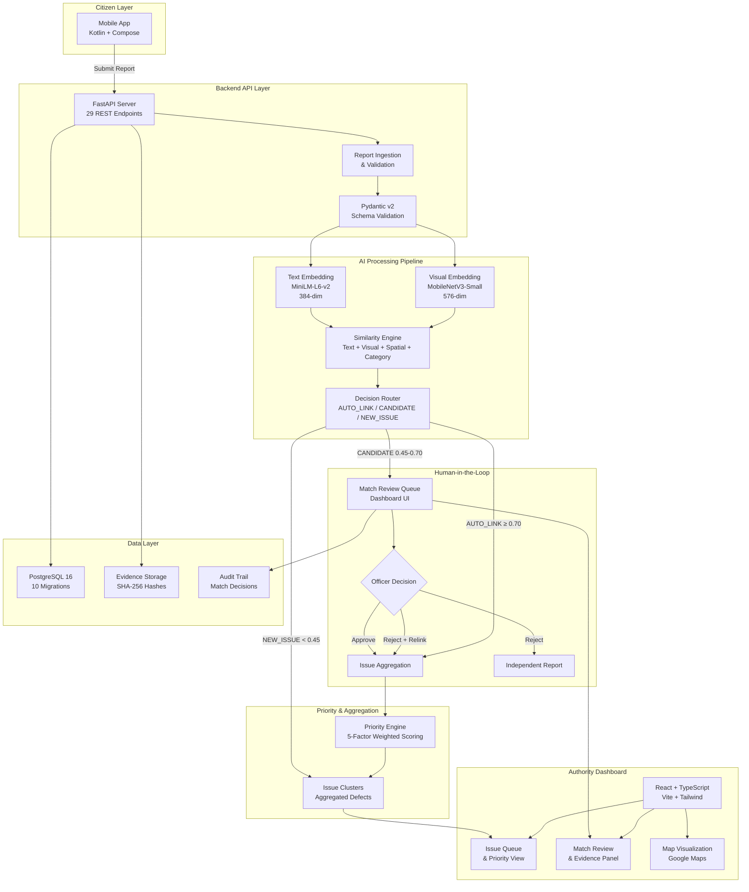

# CivicSense — Architecture Document

**Version:** 1.0.0
**Last Updated:** 2026-09-13

---

## Overview

CivicSense is a civic issue reporting and AI-assisted aggregation platform. Citizens submit reports of civic defects (potholes, garbage, water leakage, etc.) via a mobile app. A backend AI pipeline processes these reports, deduplicates them, clusters them into canonical issues, and routes them to municipal departments for resolution.

---

## System Architecture



### Data Flow Summary

1. **Citizen** submits report via mobile app → **FastAPI Backend**
2. **Validation** via Pydantic v2 schemas
3. **Text Embedding** via MiniLM-L6-v2 (384-dim)
4. **Visual Embedding** via MobileNetV3-Small (576-dim) from evidence image
5. **Similarity Search** against existing issues (text + visual + spatial + category)
6. **Decision Routing**:
   - Score ≥ 0.70 → AUTO_LINK (automatic issue linkage)
   - Score 0.45–0.70 → CANDIDATE (human review required)
   - Score < 0.45 → NEW_ISSUE (new issue created)
7. **Human Review** via dashboard (approve / reject / relink)
8. **Priority Scoring** from 5 weighted factors
9. **Dashboard** displays prioritized queues and audit trail

---

## Implemented Components

### 1. Report Ingestion (IMPLEMENTED)
- FastAPI REST endpoint `POST /api/v1/reports`
- Pydantic v2 validation (location, category, description)
- Idempotency via `client_report_id` + `X-Idempotency-Key`
- Evidence storage (base64 decode, SHA-256 hash, file persist)
- Status initialized to `SUBMITTED`

### 2. Text Analysis (IMPLEMENTED)
- **Model:** `sentence-transformers/all-MiniLM-L6-v2` (22.7M params, 384-dim)
- **Approach:** Staged offline encoding with attention-mask-aware mean pooling
- **Output:** L2-normalized dense embedding vector per report
- **Fallback:** Degraded mode (no embedding) if model unavailable

### 2b. Visual Analysis (IMPLEMENTED)
- **Model:** `mobilenet_v3_small` (trained checkpoint, 576-dim embeddings)
- **Approach:** Feature extraction from penultimate layer (after avgpool, before classifier)
- **Output:** L2-normalized 576-dim visual embedding per evidence image
- **Storage:** JSON columns on `reports.image_embedding` and `issues.image_embedding`
- **Fallback:** Graceful degradation (no embedding) if model unavailable or image invalid
- **Config:** `VISION_ENABLED`, `VISION_MODEL_CHECKPOINT`, `VISION_EMBEDDING_DIM`

### 3. Similarity Matching Engine (IMPLEMENTED — MULTIMODAL)
- **4-tier component scoring (dynamic normalization):**
  - Text similarity: Cosine of MiniLM embeddings (weight: 0.40)
  - Visual similarity: Cosine of MobileNetV3-Small embeddings (weight: 0.15)
  - Spatial proximity: Haversine distance, 50m radius (weight: 0.35)
  - Category match: Exact/bridge/mismatch (weight: 0.25)
- **Missing-modality behavior:**
  - When visual embeddings absent: Text+Distance+Category only (backward compatible)
  - When visual embeddings present: All 4 normalized to sum to 1.0
  - No false visual scores fabricated
- **3-tier routing:**
  - `AUTO_LINK` (score ≥ 0.70): Auto-link report to existing issue
  - `CANDIDATE` (0.45 ≤ score < 0.70): Route to human review
  - `NEW_ISSUE` (score < 0.45): Create new issue
- **Safety gates:**
  - Category mismatch forces `NEW_ISSUE` regardless of text/spatial proximity
  - Null Island (0,0) coordinates rejected
  - Concurrent submission protection

### 4. Priority Ranking Engine (IMPLEMENTED)
- **Formula:** `0.30*severity + 0.25*report_volume + 0.20*unique_reporters + 0.15*recency + 0.10*persistence`
- **Output:** Score 0–100 mapped to PriorityLevel (CRITICAL/HIGH/MEDIUM/LOW)
- **Auto-recompute:** Triggers on AUTO_LINK, NEW_ISSUE, and match approval
- **Batch recompute:** `POST /api/v1/issues/recompute-priority` (admin-only)

### 5. Issue Management (IMPLEMENTED)
- Canonical defect entity (multiple reports → one issue)
- Paginated list sorted by priority
- Priority breakdown endpoint
- Report linkage tracking

### 6. Match Review Workflow (IMPLEMENTED)
- Pending candidate queue
- Approve: Link report to issue, recompute priority
- Reject: Keep independent or link to alternate issue
- Audit trail: Reviewer ID, notes, timestamps
- 409 protection: Already-reviewed matches cannot be re-reviewed

### 7. Municipal Department Operations (IMPLEMENTED)
- 6 canonical departments (Roads, Waste, Water, Electrical, Planning, Public Works)
- Report assignment, acknowledgment, completion, rejection
- Reassignment loop with audit trail
- SLA tracking

### 8. Dashboard (IMPLEMENTED)
- React 18 + TypeScript + Vite + Tailwind CSS
- TanStack React Query for server state
- 11 operational routes (Overview, Reports, Issues, AI Operations, Map, Analytics, Departments, etc.)
- Match review UI with approve/reject modals
- Real-time polling (5s reports, 4s detail, 6s matches)

### 9. Mobile App (IMPLEMENTED)
- Native Android (Kotlin + Jetpack Compose)
- React Native + Expo scaffold
- Evidence capture, GPS, category selection
- Offline queue with retry
- Smart polling synchronization

---

## Prototype Components (Not Production-Ready)

### Authentication
- Prototype `X-Reviewer-ID` header mechanism
- No JWT, no session management, no RBAC
- Accepts any non-empty value

### AI Processing
- Text-only analysis (no image classification yet)
- Keyword-heuristic severity (not ML-classified)
- Deterministic demo processor for dashboard metrics

### Evaluation
- Synthetic benchmark only (300 samples)
- 100% precision/recall/F1 on synthetic duplicate pairs
- Not validated on real-world civic data

---

## Planned/Future Components

| Component | Status | Notes |
|---|---|---|
| Image Classification | PLANNED | MobileNetV3 pilot complete, not integrated |
| Multimodal Fusion | PLANNED | Evaluated, not production-wired |
| Real RBAC / JWT Auth | PLANNED | Required for public deployment |
| pgvector Embeddings | PLANNED | Currently JSON storage |
| Real-time Notifications | PLANNED | WebSocket/SSE |
| Citizen Mobile Tracking | PLANNED | Status push notifications |
| Multilingual Support | PLANNED | i18n framework |

---

## Data Model

### Core Entities
- **Report**: Individual citizen submission (evidence, location, category, status)
- **Issue**: Canonical aggregated civic defect (multiple reports)
- **Evidence**: Raw media metadata (hash, URI, type)
- **AIAnalysis**: Per-report AI outputs (category, severity, confidence)
- **ReportIssueMatch**: Audit trail for similarity decisions
- **Department**: Municipal operational division
- **ReportAssignment**: Department dispatch audit

### Key Relationships
```
Report 1──N Evidence
Report N──1 Issue
Report 1──N AIAnalysis
Report 1──N ReportIssueMatch
Issue 1──N Report
Issue 1──N ReportIssueMatch
Report 1──N ReportAssignment
Department 1──N ReportAssignment
```

---

## API Surface

| Group | Endpoints | Status |
|---|---|---|
| Health | `GET /health`, `GET /api/v1/health` | IMPLEMENTED |
| Reports | CRUD + lifecycle transitions + assignment | IMPLEMENTED |
| Issues | List, detail, priority breakdown, batch recompute | IMPLEMENTED |
| Matches | Pending, approve, reject, audit list/detail | IMPLEMENTED |
| Departments | List, detail, stats, reports | IMPLEMENTED |
| AI Operations | Jobs, events, health, metrics, trigger | IMPLEMENTED |

**Total: 29 endpoints**

---

## Database

- **Engine:** PostgreSQL 16 (psycopg 3 driver)
- **ORM:** SQLAlchemy 2.0 with strict typing
- **Migrations:** Alembic (0001–0010)
- **Test mode:** SQLite in-memory for automated tests

### Migrations Summary
| Migration | Purpose |
|---|---|
| 0001 | Core schema (reports, issues, evidence, AI, verifications) |
| 0002 | AI jobs and events tracking |
| 0003 | Edge metadata column |
| 0004 | Citizen name and phone |
| 0005 | Citizen email and postal code |
| 0006 | Report category column |
| 0007 | Departments and assignments |
| 0008 | Text embeddings (JSON) |
| 0009 | Report-issue match audit trail |
| 0010 | Issue priority fields |

---

## Infrastructure

- **Local dev:** Docker Compose (PostgreSQL 16)
- **Task runners:** Makefile, PowerShell (dev.ps1), Bash (dev.sh)
- **Linting:** Ruff (Python), ESLint + TypeScript (frontend)
- **Type checking:** mypy (Python), tsc (TypeScript)
- **Testing:** pytest (backend), Vitest (frontend)
