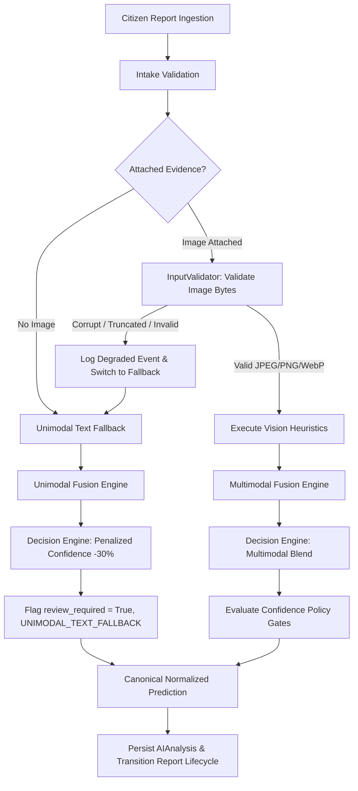

# CivicSense — AI Pipeline Production Quality Gate & Hardening Specification

**Document Reference**: `docs/architecture/ai-pipeline-hardening.md`  
**Phase**: Phase 2 — Production Quality Gate & Pipeline Hardening  
**Status**: Implemented & Verified  
**Runtime**: Python 3.14 / FastAPI / Pydantic v2 / Pillow 12  

---

## 1. Executive Summary

This specification establishes the production quality gates, input validation boundaries, confidence governance policies, telemetry instrumentation, and unimodal fallback semantics for the CivicSense AI/ML pipeline.

In adherence to `AGENTS.md` (Rules 1, 5, 6, and 10), this architecture strictly distinguishes between:
1. **Raw External Ingestion Payloads** (client-declared, untrusted)
2. **Validated & Canonical Ingestion Payloads** (cryptographically hashed, sanitized)
3. **Provisional Model Inferences** (probabilistic advisory recommendations)
4. **Official Municipal Civic Verifications** (human-driven, binding administrative records)

---

## 2. Input Validation Specifications & Data Quality Gates

The `InputValidator` module (`app.services.ai.input_validator.py`) enforces strict boundaries on both image and textual evidence before processing.

### A. Image Validation Matrix

| Parameter | Configuration Limit | Enforcement Mechanism | Failure Exception |
| :--- | :--- | :--- | :--- |
| **Supported MIME Types** | `image/jpeg`, `image/png`, `image/webp` | Strict magic byte inspection (first 16 bytes) | `UnsupportedImageTypeError` |
| **Unsupported Types** | `image/gif`, `image/svg+xml`, `application/octet-stream`, `image/bmp`, `image/tiff`, executables (`MZ`, `\x7fELF`) | Explicit signature blacklist & whitelist rejection | `UnsupportedImageTypeError` |
| **Maximum File Size** | 10,485,760 bytes (10 MB) | Raw byte length inspection prior to decode | `OversizedImageError` |
| **Empty Payloads** | 0 bytes | Zero-length byte check | `InvalidImagePayloadError` |
| **Minimum Dimensions** | 64 × 64 pixels | Pillow header inspection (`img.size`) | `ImageDimensionsInvalidError` |
| **Maximum Dimensions** | 8192 × 8192 pixels | Pillow header inspection (`img.size`) | `ImageDimensionsInvalidError` |
| **Pixel Ceiling (Decompression Bomb)** | 25,000,000 pixels (25 MP) | `Image.MAX_IMAGE_PIXELS` & pre-raster `w * h` check | `ImageDecompressionBombError` |
| **Integrity & Truncation** | Valid tables, markers, and pixel stream | Two-phase decode: `img.verify()` + `img.load()` | `CorruptImageError` |

### B. Magic Byte Signatures

```python
MAGIC_JPEG      = b"\xFF\xD8\xFF"
MAGIC_PNG       = b"\x89PNG\r\n\x1a\n"
MAGIC_WEBP_RIFF = b"RIFF"  # with b"WEBP" at bytes 8:12
MAGIC_GIF       = (b"GIF87a", b"GIF89a")
```

Client-declared `Content-Type` headers or file extensions are treated as advisory hints only. If a payload declares `image/jpeg` but possesses PNG magic bytes, `InputValidator` assigns the true MIME type `image/png`.

### C. Text Sanitization & Safety Matrix

| Rule | Enforcement Strategy | Failure Behavior |
| :--- | :--- | :--- |
| **Null Bytes & Control Characters** | Filter characters with Unicode category `Cc` while preserving `\n`, `\r`, `\t` | Stripped cleanly |
| **Unicode Canonicalization** | Normalize text using Unicode Normalization Form KC (`unicodedata.normalize('NFKC')`) | Standardized to canonical composition |
| **Consecutive Newlines** | Regex replacement `\n{3,}` -> `\n\n` | Collapsed to double newline |
| **Empty / Whitespace** | `trimmed = raw_text.strip()`; check `len(trimmed) == 0` | Raises `TextValidationError` (422) |
| **Minimum Meaningful Length** | Must exceed 2 characters unless matching emergency civic tokens (`sos`, `leak`, `fire`, etc.) | Raises `TextValidationError` (422) |
| **Maximum Description Length** | Configurable: 5,000 characters (`MAX_DESCRIPTION_LENGTH`) | Raises `TextValidationError` (422) |
| **Pathological / Spam Runs** | Detect runs of >= 20 identical characters: `(.)\1{19,}` | Punctuative runs collapsed to 3 chars; degenerative text raises `TextValidationError` |

---

## 3. Canonical Prediction Normalization Schema (`NormalizedPrediction`)

To decouple internal analyzer heuristics or neural network representations from the rest of the application, all AI outputs are normalized into `NormalizedPrediction` (`app.schemas.normalized_prediction.py`).

### Schema Definition

```python
class NormalizedPrediction(BaseModel):
    predicted_category: str
    category_label: str
    confidence: float = Field(ge=0.0, le=1.0)
    confidence_tier: PredictionConfidenceTier
    severity: SeverityLevel
    priority: PriorityLevel
    evidence_agreement: float = Field(ge=0.0, le=1.0)
    model_name: str
    model_version: str
    inference_source: str
    inference_time_ms: int = Field(ge=0)
    requires_review: bool
    review_reasons: list[str] = Field(default_factory=list)
    warnings: list[str] = Field(default_factory=list)
    top_predictions: list[CategoryPredictionItem] = Field(default_factory=list)
    decision_explanation: str
    hardware_acceleration: str = "NONE"
    timing_breakdown: dict[str, int] = Field(default_factory=dict)
    disclaimer: str = (
        "AI predictions are advisory suggestions and do not constitute official municipal verification."
    )
```

### Adapter Validation & Fallback Handling

The `PredictionNormalizer` adapter (`app.services.ai.normalized_prediction.py`):
1. **Validates Raw Model Outputs**: Rejects missing keys (`confidence`, `suggested_category`) and out-of-range floats (`confidence < 0.0 or > 1.0`).
2. **Generates Human-Readable Labels**: Maps canonical codes to official labels (e.g. `Pothole` -> `"Pothole / Road Surface Cavity"`).
3. **Safe Fallback Construction**: Exposes `create_fallback_prediction()` to ensure degraded-mode pipeline completions when upstream models fail without crashing the ingestion flow.

---

## 4. Confidence Governance Policy & Decision Gate Matrix

Predictions are categorized into strict policy tiers rather than exposing raw continuous probabilities directly to decision-makers.

| Confidence Tier | Probability Range | Policy Routing | Operational Action |
| :--- | :--- | :--- | :--- |
| **HIGH** | `[0.80, 1.00]` | `review_required = False` (if multimodal agreement is concordant) | Eligible for automated queue dispatch |
| **MEDIUM** | `[0.65, 0.79]` | `review_required = False` (or conditional review if cross-modal discrepancy exists) | Advisory triage with highlighted signals |
| **LOW** | `[0.50, 0.64]` | `review_required = True`, `review_reason = "LOW_CONFIDENCE"` | Mandatory municipal verification queue |
| **UNCERTAIN** | `[0.00, 0.49]` | `review_required = True`, `review_reason = "LOW_CONFIDENCE"` | Mandatory municipal verification queue |
| **FAILED** | `0.00` (Degraded) | `review_required = True`, `review_reason = "PIPELINE_ERROR"` | Flagged for manual technician inspection |

### Cross-Modality Agreement Gate
- If multimodal agreement falls below `AI_MODALITY_AGREEMENT_THRESHOLD` (0.60) in reports with valid visual evidence:
  - `review_required = True`
  - `review_reason = "MODALITY_DISAGREEMENT"`
  - Warning `"MODALITY_AGREEMENT_LOW"` appended to prediction.

### Unclassified Category Gate
- If suggested category is `"Other"`:
  - `review_required = True`
  - `review_reason = "UNCLASSIFIED_ISSUE"`
  - `confidence_tier = UNCERTAIN`

---

## 5. Civic Verification Separation Invariant

A fundamental architectural invariant of CivicSense is the decoupling of AI inference from administrative verification:

```
[ Citizen Report ]
       │
       ▼ (Status: SUBMITTED)
[ AI Intake & Pipeline ]
       │
       ├─────────────────────────────────────────────┐
       ▼ (High Confidence Concordance)               ▼ (Low Conf / Fallback / Conflict)
(Status: AI_PROCESSED)                        (Status: VERIFICATION_REQUIRED)
       │                                             │
       └──────────────────────┬──────────────────────┘
                              ▼
           [ Human Verification Officer ] (POST /verifications)
                              │
                              ▼ (Status: VERIFIED)
           (Decision: CONFIRMED | REJECTED | DUPLICATE)
```

### Invariants:
1. **AI Output Is Always Advisory**: Every analysis record contains an immutable legal disclaimer:  
   `"AI predictions are advisory suggestions and do not constitute official municipal verification."`
2. **AI Never Directly Modifies Verification Status**:
   - `report.verifications` is modified exclusively via `POST /api/v1/reports/{id}/verifications`.
   - AI processing transitions report lifecycle strictly between `SUBMITTED` -> `AI_PROCESSING` -> `AI_PROCESSED` or `VERIFICATION_REQUIRED`.
   - An AI run can never set a report's lifecycle status to `VERIFIED`.

---

## 6. Graceful Unimodal Fallback & Error Resilience

Civic issues submitted under real-world conditions frequently involve poor connectivity, damaged lenses, missing attachments, or corrupted uploads. The pipeline must never fail or destroy citizen reports due to media corruption.



### Unimodal Fallback Guarantees:
- **Confidence Penalty**: Overall confidence is penalized: `overall_confidence = round(text_conf * 0.70, 2)`.
- **Mandatory Human Review**: `review_required = True`, `review_reason = "UNIMODAL_TEXT_FALLBACK"`.
- **Inference Source Tag**: Set to `"unimodal_text_fallback"` with warning `"IMAGE_UNAVAILABLE_FALLBACK"`.
- **Zero Ingestion Crashes**: Corrupt images or unhandled vision analyzer exceptions are logged as degraded events; the report transitions safely to `VERIFICATION_REQUIRED`.

---

## 7. Timing Telemetry & Hardware Transparency

Every pipeline execution records high-resolution stage latency and transparent hardware disclosures.

### Telemetry Breakdown Schema

```json
{
  "timing_breakdown": {
    "intake_validation_ms": 1,
    "preprocessing_ms": 1,
    "vision_inference_ms": 2,
    "text_inference_ms": 1,
    "fusion_ms": 1,
    "decision_ms": 1,
    "normalization_ms": 1,
    "total_pipeline_ms": 8
  },
  "hardware_acceleration": "NONE",
  "device_metrics": {
    "cpu_count": 8,
    "platform": "Windows-11-..."
  }
}
```

- **High-Resolution Clock**: Latencies measured using `time.perf_counter()`.
- **Truthful Hardware Disclosure**: Hardware acceleration is explicitly declared as `"NONE"`. The system explicitly discloses CPU rule execution and makes no false claims of neural acceleration, GPU, or NPU usage.

---

## 8. Test Catalog & Requirement Mapping

The 30 required quality gate scenarios are implemented in `backend/tests/api/test_ai_pipeline_hardening.py` and run fully offline without external network dependencies.

| # | Scenario | Test Function | Result |
| :-: | :--- | :--- | :-: |
| 1 | Valid JPEG image | `test_1_valid_jpeg_image_validation` | PASSED |
| 2 | Valid PNG image | `test_2_valid_png_image_validation` | PASSED |
| 3 | Valid WebP image | `test_3_valid_webp_image_validation` | PASSED |
| 4 | Corrupt image bytes | `test_4_corrupt_image_bytes_rejected` | PASSED |
| 5 | Declared JPEG, actual PNG magic bytes | `test_5_declared_jpeg_actual_png_magic_bytes` | PASSED |
| 6 | Below-minimum dimensions (<64px) | `test_6_below_minimum_dimensions_rejected` | PASSED |
| 7 | Above-maximum dimensions (>8192px) | `test_7_above_maximum_dimensions_rejected` | PASSED |
| 8 | Payload exceeding max size (>10MB) | `test_8_image_payload_exceeding_max_byte_size_rejected` | PASSED |
| 9 | Decompression bomb attempt (>25MP) | `test_9_decompression_bomb_attempt_rejected` | PASSED |
| 10 | Empty image payload (0 bytes) | `test_10_empty_image_payload_rejected` | PASSED |
| 11 | Unsupported formats (GIF, SVG, EXE) | `test_11_unsupported_image_formats_rejected` | PASSED |
| 12 | Valid text description (NFKC normalized) | `test_12_valid_text_description_normalized` | PASSED |
| 13 | Text with null / control characters | `test_13_text_with_null_and_control_chars_sanitized` | PASSED |
| 14 | Text exceeding character ceiling (>5000) | `test_14_text_exceeding_max_character_limit_rejected` | PASSED |
| 15 | Repeated character run defense | `test_15_text_degenerative_repeated_characters_handled` | PASSED |
| 16 | Empty or whitespace-only description | `test_16_empty_or_whitespace_text_rejected` | PASSED |
| 17 | Full multimodal pipeline execution | `test_17_multimodal_pipeline_execution` | PASSED |
| 18 | Unimodal fallback on missing image | `test_18_unimodal_fallback_missing_image` | PASSED |
| 19 | Unimodal fallback on corrupt image | `test_19_unimodal_fallback_corrupt_image` | PASSED |
| 20 | Processor exception in vision stage | `test_20_processor_exception_in_vision_stage_graceful` | PASSED |
| 21 | Malformed model output schema validation | `test_21_malformed_model_output_rejected_and_fallback_applied` | PASSED |
| 22 | High confidence tier (>= 0.80) | `test_22_high_confidence_tier_no_review` | PASSED |
| 23 | Medium confidence tier (0.65 - 0.79) | `test_23_medium_confidence_tier` | PASSED |
| 24 | Low confidence tier (0.50 - 0.64) | `test_24_low_confidence_tier_requires_review` | PASSED |
| 25 | Uncertain confidence tier (< 0.50) | `test_25_uncertain_confidence_tier` | PASSED |
| 26 | Conflicting modalities (< 0.60 agreement) | `test_26_conflicting_modalities_requires_review` | PASSED |
| 27 | Category 'Other' prediction | `test_27_category_other_requires_review` | PASSED |
| 28 | Raw model dict normalized to schema | `test_28_raw_model_dict_normalized_to_schema` | PASSED |
| 29 | Civic verification separation invariant | `test_29_verification_separation_invariant` | PASSED |
| 30 | End-to-end API integration | `test_30_end_to_end_api_pipeline_hardening` | PASSED |
